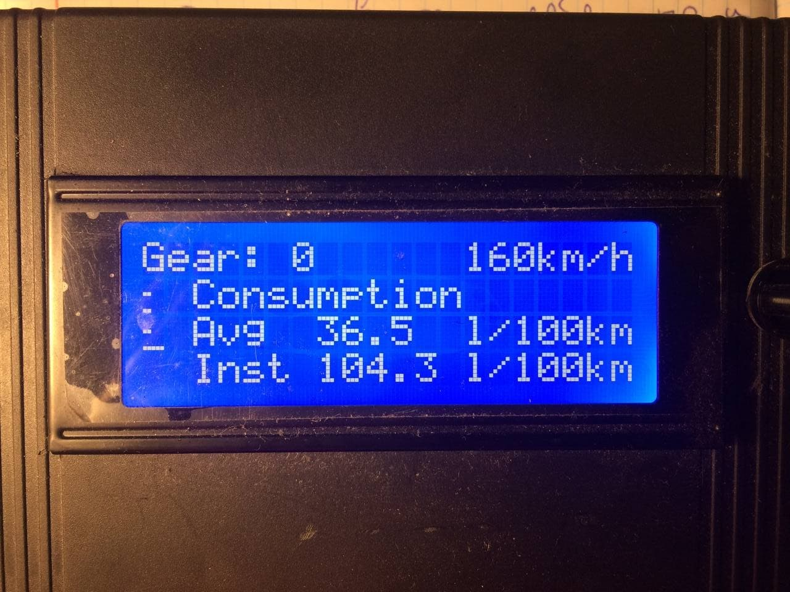

<p align="center">

</p>

<h1 align="center">Контроллер для Euro Truck Simulator 2 на основе Arduino</h1>

     Проект на данный момент находится в разработке и не закончен
<h2 align="center"><i>Содержание</i></h2></br>

- [Что из себя представляет контроллер?](#descr)
- [Элементы контроллера](#elements)
  - [Лампы ошибок и поворотников](#lights)
  - [Стрелки спидометра и тахометра](#arrows)
  - [Бортовой компьютер](#pc)
- [Синхронизация с Euro Truck Simulator 2](#synchro)
- [Руль и педали](#wheel)
- [Планы на разработку](#next)

<a name="descr"></a>

## Что из себя представляет контроллер?
Играя в уже, наверное, всем известный Euro Truck Simulator 2, используя в качестве руля мышку, мне пришла в голову мысль - а почему бы не собрать настоящий тренажёр как в автошколе! На полноценную кабину грузовика ни места в комнате, ни ресурсов не хватит, однако ведь можно сделать приборную панель грузовика, да чтоб с рулём, щитком приборов и всеми элементами управления (по возможности). Этот момент и стал рождением данного проекта, цель которого - недорого и с умом сделать интерактивную панель управления грузовика, которая синхронизированно работает с игрой Euro Truck Simulator 2.

<a name="elements"></a>
## Элементы контроллера

Итого контроллер должен состоять из следующих элементов:

- [x] Спидометр
- [x] Тахометр
- [x] Лампочки ошибок и поворотников
- [ ] Бортовой компьютер
- [x] Руль
- [x] Педали
- [ ] Коробка передач (H-shifter)
- [x] Тумблера и кнопки для управления грузовиком
- [ ] Корпус, которой объединит все элементы в один контроллер

<a name="lights"></a>
<h4 align="center">Лампы ошибок и поворотников</h4>
В качестве ламп ошибок и поворотников было решено поставить обычные светодиоды, которые подключены к цифровым выводам ардуино через резисторы 220 Ом. Работа этих ламп выглядит следующим образом:

<p align="center">

</p>

<a name="arrows"></a>
<h4 align="center">Стрелки спидометра и тахометра</h4>
Родные шаговые двигатели (которые стрелки и двигали) из щитка приборов было решено выбросить, поскольку я не нашёл даташитов к ним. Поэтому было принято решение использовать обычные микросервоприводы, что облегчило и удешевило прибор. Плюс ко всему, к сервоприводам уже давно существуют библиотеки.
<p align="center">
</br>
<i>Работа тахометра</i></br></br>
</br>
<i>Работа спидометра</i></br></br>
</p>

<a name="pc"></a>
<h4 align="center">Бортовой компьютер</h4>

> **WARNING**: во время теста было замечено, что шина I2C намертво блокирует ардуино. В итоге микроконтроллер не обрабатывает данные. Без дисплея всё работает прекрасно. Анализ проблемы в прогрессе

Во всех грузовиках есть бортовой компьютер, на который выводится основная информация по авто:

- Скорость и круиз контроль
- Текущая передача
- Температуры масла и воды
- Давление в контурах тормозной системы
- Давление масла
- Расходы мгновенный и на 100 км

Для реализации такого устройства был взят обычный символьный дисплей 20х4, для которого написан класс-оболочка. Сам бортовой ПК управляется при помощи потенциометра\\энкодера, встроенного в корпус. Вкладки следующие:
<p align="center">
</br>
<i>Вкладка скорости и круиз-контроля</i></br></br>
</br>
<i>Вкладка температур</i></br></br>
</br>
<i>Вкладка давления</i></br></br>
</br>
<i>Вкладка потребления топлива</i></br></br>
</br>
<i>Работа бортового ПК</i></br></br>
</p>

<a name="synchro"></a>
## Синхронизация с Euro Truck Simulator 2
Контроллер связан с игрой при помощи COM-порта. Ардуино эмулирует этот порт и подключается к компьютеру по USB. Благодаря разработчикам игры из SCS Software, которые любезно открыли исходный код, отвечающий за телеметрию, у нас есть возможность создавать данный проект. Со стороны игры есть класс, который упаковывает нужные данные в массив байт, который посылается этим же классом на последовательный порт. Вот часть кода класса-упаковщика, который отвечает за открытие порта:
```C++
bool ComController::openCom()
{
    m_hComPort = CreateFile(m_comName, GENERIC_WRITE, NULL, NULL, OPEN_EXISTING, FILE_ATTRIBUTE_NORMAL, NULL);
    if (m_hComPort == INVALID_HANDLE_VALUE) {
        m_comState = false;
        return m_comState;
    }
    DCB serialParams = { 0 };
    serialParams.DCBlength = sizeof(serialParams);
    if (!GetCommState(m_hComPort, &serialParams)) {
        m_comState = false;
        return m_comState;
    }
    serialParams.BaudRate = CBR_115200;
    serialParams.ByteSize = 8;
    serialParams.Parity = NOPARITY;
    serialParams.StopBits = ONESTOPBIT;
    assert("Cannot set COM state" && SetCommState(m_hComPort, &serialParams));
    if (!SetCommState(m_hComPort, &serialParams)) {
        m_comState = false;
        return m_comState;
    }
    m_packet[SYNC_FIRST] = 126;
    m_comState = true;
    return m_comState;
}
```
Со стороны Ардуино код распаковывает полученный массив байт и, в зависимости от полученных данных, подаёт нужные сигналы на свои порты, к которым подключены лампочки, сервоприводы, дисплей бортового ПК...

<a name="wheel"></a>
## Руль и педали
Как уже сообщалось, руль делается на основе инкрементального оптического энкодера, в моём случае - 600 импульсов на оборот. За основу был взят руль Logitech Formula Force EX. Несколько фото:

<p align="center">
</br>
<i>Оптический энкодер</i></br></br>
</br>
<i>Интегрированный энкодер</i></br></br>
</br>
<i>Руль</i></br></br>
</p>

Педали - самое простое в этом проекте. Это 2 потенциометра и всё. Подпаялись к ним - подключили к ATMega32U4 и готово! Фото:

<p align="center">
</br>
<i>Потенциометр тормоза</i></br></br>
</br>
<i>Потенциометр газа</i></br></br>
</br>
<i>Блок педалей изнутри</i></br></br>
</br>
<i>Педали</i></br></br>
</p>


<a name="next"></a>
## Планы на разработку
В дальнейшем планируется следующее:

- Корпус для объединения всех элементов контроллера
- Коробка передач
- Дисплей
